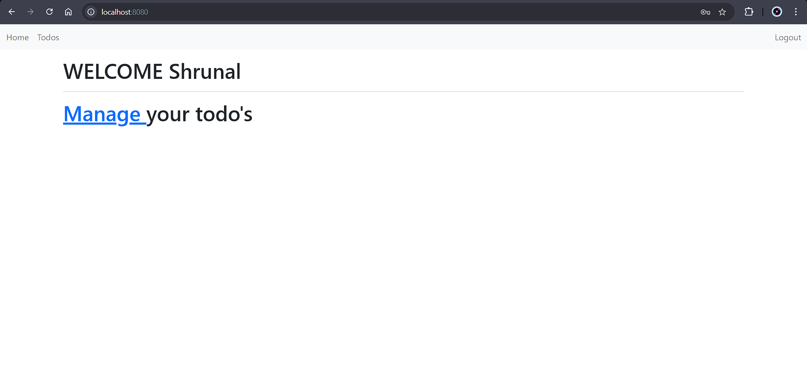

# Todo Web Application

A simple web application to manage your daily tasks. This application is built using HTML, CSS, JavaScript for the front end and Spring Boot for the back end. It demonstrates the basics of web application development including CRUD operations, user authentication, and data persistence.

## Features

- Add, update, and delete tasks
- User authentication
- Responsive design

## Technologies Used

- Frontend: HTML, CSS, JavaScript
- Backend: Spring Boot
- Database: H2 (for initial understanding), Docker container with SQL (for data storage)

## Screenshots

### Login Page

### Home Page

### Add Task

### Task List

## Getting Started

### Prerequisites

- JDK 11 or higher
- Maven
- Docker
- IDE (IntelliJ, Eclipse, etc.)

### Acknowledgements

- [Spring Boot](https://spring.io/projects/spring-boot)
- [H2 Database](https://www.h2database.com/html/main.html)
- [Docker](https://www.docker.com/)
- [Bootstrap](https://getbootstrap.com/)

## Contact

For any questions or feedback, please reach out to [Shrunal Nimje](https://github.com/ShrunalNimje).
